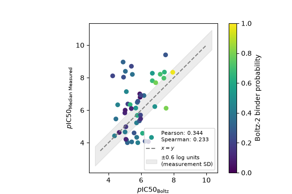

# Mini Project: Benchmarking Boltz-2 Affinity Predictions on EGFR Kinase Inhibitors

**Question:** How well does Boltz-2 rank known EGFR inhibitors by potency, compared with simple cheminformatics baselines?

**Target:** Human EGFR (ChEMBL target `CHEMBL203`, UniProt `P00533`)

**Deliverable:** Reproducible Jupyter notebooks + README in a public GitHub repo.

## Environment

Windows 11, NVIDIA GeForce RTX 4060 Laptop GPU (8 GB VRAM), driver 581.86.
Miniconda, Python 3.11.

### Installation

I found during my installation that order matters. 
Installing boltz first can pull a CPU-only PyTorch build.

```bash
conda create -n boltz python=3.11 -y
conda activate boltz

# GPU-enabled PyTorch, from NVIDIA's index, not PyPI
python -m pip install torch --index-url https://download.pytorch.org/whl/cu124 --force-reinstall --no-cache-dir
python -c "import torch; print(torch.cuda.is_available())"   # must print True

pip install "boltz[cuda]" -U
pip install rdkit pandas numpy scipy scikit-learn matplotlib seaborn \
            chembl_webresource_client py3Dmol pyyaml requests

# verify torch survived the boltz install
python -c "import torch; print(torch.version.cuda, torch.cuda.is_available())"
```

`environment.yml` is provided as a record of the exact resolved versions, but
`conda env create -f environment.yml` will install a CPU-only PyTorch, since the
custom index URL is not preserved. Follow the steps above instead. 
Use `conda env export --no-builds > environment.yml`

Python 3.13 does not work: boltz pins scipy==1.13.1, fails to build from source on Windows.

### Versions

- boltz: 2.2.1
- torch: 2.6.0+cu124
- rdkit: 2026.3.6

### Data Source

Raw Data: data\raw\CHEMBL203_activities.zip

Data source: ChEMBL 37, target CHEMBL203, downloaded 2026-09-24.
NB: The EGFR target report card: https://www.ebi.ac.uk/chembl/explore/target/CHEMBL203

## Notebooks

### Processing raw input data

Use the notebook `notebook/chembl_data.ipynb` to process raw ChEMBL data to a clean .csv

Useful ChEMBL reference:
    - Activity data documentation: https://chembl.gitbook.io/chembl-interface-documentation/frequently-asked-questions/chembl-data-questions
    - webinar overview on ChEMBL database: https://www.ebi.ac.uk/training/events/chembl-workshop-drug-design/

Cleaning notes:
    - Removed invalid rows, e.g. missing pChEMBL data 
    - Only assays which measure binding affinity by IC50 (Ki, Kd are a small minority of binding affinity measurements)
    - Remove assays for mutants. Matches to strings in the "Assay Description"
        T790M 4732
        L858R 4773
        C797S 1399
        G719 1
        A431 1072
        L861Q 135
        E746 98
        \bexon 640
        \bdel 2354
        insert 97
        mutant 4523
        variant 0
    - Rows containing smiles strings which could not be standardized are removed. These failures are tracked in `data/processed/standardization_failures.csv`.
    - For duplicate measurements, the median pChEMBL Value is used in a cleaned data frame, saved at `data/processed/egfr_clean.csv`.
    - Median SD 0.5 log units across compounds with ≥3 measurements. This is essentially a noise floor for predictions by Boltz-2.

Summary of ChEMBL data filtering:
| Step                                                                                        |   N Rows |   Rows Removed |   N compounds |   Compounds Removed |
|:--------------------------------------------------------------------------------------------|---------:|---------------:|--------------:|--------------------:|
| Raw table                                                                                   |    58847 |            nan |         19118 |                 nan |
| Valid row : Binding Assay, Standard Relation, Homo Sapiens, pChEMBL Value, Valid            |    19866 |          38981 |         10761 |                8357 |
| Drop rows with missing smiles                                                               |    19866 |             -0 |         10761 |                  -0 |
| Limit the type of measurements to IC50, Ki and Kd                                           |    19544 |            322 |         10734 |                  27 |
| Assay Type, only IC50 for consistency of measure.                                           |    18123 |           1421 |         10424 |                 310 |
| Remove mutants, deletions and other variants.                                               |     9422 |           8701 |          6748 |                3676 |
| Standardized structures. See failed attempts at data/processed/standardization_failures.csv |     9414 |              8 |          6740 |                   8 |
| Merged duplicate measurements.                                                              |     6710 |           2704 |          6710 |                  30 |
| Removed non-organic entries.                                                                |     6709 |              1 |          6709 |                   1 |

### Exploratory Cheminformatics

Use the notebook `notebook/cheminformatics.ipynb` to explore cheminformatics on clean dataset. 

- Table of common descriptors + distribution plots + drug-like heuristics indicated, see `figures/molecular_descriptors.png`
- Lipinski RO5 compliance, only ~50% have 0 violations
- Mean ligand efficiency near 0.3, which is a desirable metric
- Most common Bemis–Murcko scaffolds account for ~15% of dataset, see `figures/top_scaffolds.png` -> diverse chemistry?
- Molecules classified as covalent, 4-Anilinoquinazoline-like, aminopurine-like, monocyclic or other, using SMARTS
- Whether using the Murcko scaffold or the manual classification, these 
groupings are strong predictors of potency. This is a lower bound of performance against which the model will be validated

| Classification            |   count |   median |     std |
|:--------------------------|--------:|---------:|--------:|
| 4-Anilinoquinazoline-like |    1577 |     7.31 | 1.17361 |
| Aminopurine-like          |     161 |     8.22 | 1.04396 |
| Covalent                  |    1838 |     7.07 | 1.27307 |
| Monocyclic                |      64 |     5.08 | 1.01039 |
| Other                     |    3069 |     6.26 | 1.25205 |

- Fingerprints were used to compute Tanimoto similarities on a random subset. Since the mean pairwise Tanimoto is only 0.16, the dataset is largely chemically diverse. See `figures/tanimoto_similarity_sample_heat.png` or `figures/tanimoto_similarity_sample_dist.png`
- In a principal component analysis over the fingerprints, the first two components explain ~11% of the variance. The classifiers cluster on PC1/PC2, see `figures\PCA_fingerprints_pred_class.png`. Additionally, the first two components very roughly separate the low affinity molecules from the rest of the dataset, see `figures/PCA_fingerprints_pred_activity.png`

### Subset selection

Use the notebook `notebooks/subset_selection.ipynb` to select a subset of molecules for activity predictions by Boltz-2. 

- Molecules are assigned to potency bins (low : 0-6, mid : 6-8, high : 8+)
- There is a moderate indication of potency, relative to manual classification.

| Potency   |   4-Anilinoquinazoline-like |   Aminopurine-like |   Covalent |   Monocyclic |   Other |
|:----------|----------------------------:|-------------------:|-----------:|-------------:|--------:|
| low       |                         206 |                  3 |        410 |           46 |    1269 |
| mid       |                         938 |                 64 |        991 |           18 |    1489 |
| high      |                         433 |                 94 |        437 |            0 |     311 |

- 15 molecules are selected per potency group. These selections are stratified by chemotype using rdkits's `MinMaxPicker` over the fingerprints (Morgan).
- 6 well-known drugs targeting EGFR are added to the subset. They span 4 binding types (type I, type II, type $1\tfrac{1}{2}$ and type VI (covalent); allosteric binding types are not included). A reference complex is available from the PDB for each binding type. Two of the drugs are covalent binders with no available experimental structure.
- Note: orininally, one additional covalent binder was included in the known references. Pelitinib was removed after matching the Clean InchiKey failed between the main and reference dataframes. This could indictate an issue with the protocol for standardization from Smiles. This will be ignored for now.
- Decoys/Inactives are added so the set includes approximate nonbinders. DUD-E decoys are sometimes identified as nonbinders using physicochemical properties alone. Instead, binders with *very* low activities are used as inactive decoys instead. These were matched on physicochemical properties. 
- Removed inactives (i.e. decoys) which are analogues of actives using fingerprint similarity, and selected 10 randomly for the subset
- Total of 61 molecules in the subset

### Prepare Boltz inputs

Use the notebook `notebooks/boltz_inputs.ipynb` to prepare inputs for Boltz-2.

- Obtained EGFR sequence from UniProt `P00533`, shifting sequence indexing to exclude the signal peptide and account for 1-indexing residue numbering.
- Selected the kinase domain from full EFGR as residues [672-998]. The selection is based on the erlotinib complex. Alignment was verified using several key residues. ref: Stamos et al. 2002 Structure.
- Yaml files were prepared using the fixed sequence and the selected subset (see above). One yaml per compound (61).
- An initial run on CHEMBL104 was used to get the MSA sequence. Subsequent yaml files point to this precomputed MSA file. 
- The subset compounds are drawn in batches and stored at `figures/boltz_subset_mols` for convenience. 

### Run Boltz predictions

As above, use the notebook `notebooks/boltz_inputs.ipynb` to prepare inputs for Boltz-2.

- The human EGFR sequence was downloaded from UNIPROT. The sequence was truncated to the kinase domain [672–998], mimicking the numbering of the erlotinib complex (PDB: 1M17). Sequence alignment accounts for 1-indexing and signal peptide, and was verified against several key peptides.
- The clean smiles of each compound in the boltz subset and the kinase domain sequence were written to yaml files (total=61).
- A depiction of each molecule in the subset was drawn and summarized. See `figures/boltz_subset_mols/boltzs_subset_page[01-11].png
- Each compound + the kinase sequence were written to a yaml input file.
- The flags `--use_msa_server` and `--no_kernels` were used after troubleshooting a test prediction run. See notebook for details.
- Some predictions fail due to memory allocation errors. The batch run was restarted with the flag `--overwrite` until all the predictions were completed.
- The runtime for the subset predictions were written to `data/processed/runtime_log.csv`. This contains several outliers due to long idle time (CHEMBL3915508, t=76529 s) or restarted calculations on completed predictions (e.g. CHEMBL271410, 9.0s). Most computations needed ~5-15 minutes.
- Only one prediction computation failed, which was excluded from the subset (CHEMBL58)

### Evaluate Boltz predictions

Use the notebook `notebooks/evaluate_predictions.ipynb` to parse the Boltz-2 predictions.

- Affinity predictions and confidence estimations were extracted from Boltz prediction JSON files into a dataframe.
- The affinity predictions (IC50 [µM]) were converted to pIC50. 
- The table of compounds + prediction and confidence estimations are in `data/processed/boltz_preds.csv`
- The correlation between predicted and experimental pIC50 values were assessed using Pearson and Spearman correlations. Bootstrapping was used to generate a confidence interval for each, with Pearson: 0.34 [0.10, 0.60], p: 0.01 and Spearman: 0.23 [-0.02, 0.49], p: 0.10. At this sample size (50), the data cannot distinguish a genuine moderate correlation to no correlation at all on compound ranking. 
- Scatter plot of prediciton vs. measurement (noncovalent)

